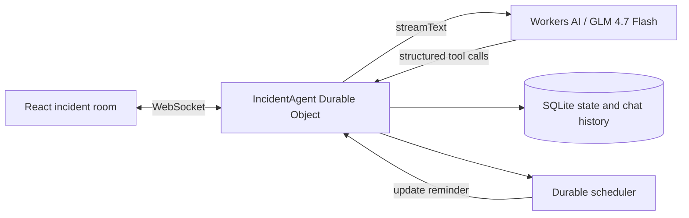

# SignalDesk

SignalDesk is a stateful incident-response copilot built entirely on Cloudflare. It gives an incident team one durable war room where an AI assistant can summarize evidence, maintain the timeline, assign actions, schedule updates, and request approval before resolving an incident.

## Assignment coverage

| Requirement             | Implementation                                                                             |
| ----------------------- | ------------------------------------------------------------------------------------------ |
| LLM                     | GLM 4.7 Flash on Workers AI through `workers-ai-provider`                                  |
| Workflow / coordination | `AIChatAgent` coordinates tool calls; Durable Object scheduling runs update reminders      |
| User input              | Streaming React chat over the Agents SDK WebSocket transport                               |
| Memory / state          | Chat history and typed incident state persist in each Agent's SQLite-backed Durable Object |
| Human control           | The `changeIncidentStatus` tool requires explicit approval before resolution               |

## What it demonstrates

- Streaming, reconnectable AI chat with up to 100 persisted messages
- A shared incident record synchronized to every connected client
- Structured tools for findings, incident metadata, action ownership, and status changes
- Durable delayed execution for stakeholder update reminders
- Human-in-the-loop approval for the consequential resolution action
- Bounded synchronized state to avoid broadcasting an unbounded timeline
- A health endpoint at `/api/health` for deployment checks

## Architecture



Each room name maps to one Agent instance. That instance owns its chat history, incident state, schedules, and live WebSocket connections. Tool execution happens next to the state, avoiding a separate database round trip and making updates immediately consistent.

See [docs/ARCHITECTURE.md](docs/ARCHITECTURE.md) for the data flow, safety model, and tradeoffs.

## Local development

Prerequisites:

- Node.js 22 or newer
- pnpm 10
- A Cloudflare account authenticated with `wrangler login`

Workers AI has no local simulator. The configuration uses a remote Workers AI binding, so local chat requires Cloudflare authentication but no third-party model key.

```bash
pnpm install
pnpm run types
pnpm dev
```

Open `http://localhost:5173`.

## Demo script

1. Ask: `Summarize the incident for leadership`.
2. Report: `Payment retries rose immediately after the 09:05 deploy. Record that from the metrics dashboard.`
3. Ask: `Assign Priya to compare payment errors across the last two deploys.`
4. Ask: `Schedule the next stakeholder update in 15 minutes.`
5. Ask: `Resolve the incident because the rollback restored latency to baseline.`
6. Approve or reject the resolution tool in the chat. The status changes only after approval.
7. Refresh the page and confirm that chat, timeline, actions, and status remain.

## Quality checks

```bash
pnpm test
pnpm check
pnpm build
```

The unit suite covers initial state, immutable timeline updates, resolution audit records, action assignment, and the synchronized-state size bound.

## Deploy

```bash
pnpm deploy
```

Wrangler creates the SQLite-backed Durable Object namespace from the `v1` migration and deploys both the Worker and static client. After deployment, verify:

```bash
curl https://<worker>.<subdomain>.workers.dev/api/health
```

## Project structure

```text
src/
  server.ts       Agent, Workers AI orchestration, tools, scheduling, routing
  incident.ts     Typed incident model and pure state transitions
  app.tsx         Real-time chat and incident workspace
  client.tsx      React entry point
  styles.css      Responsive visual system
test/
  incident.spec.ts
```

## Known production follow-ups

- Add Cloudflare Access before using real operational data.
- Replace the fixed demo room with authenticated tenant and incident identifiers.
- Connect observability tools to production metrics, logs, and deployment APIs through scoped MCP servers.
- Store a large historical timeline in Agent SQL and keep only a small synchronized projection in state.
- Add rate limits, PII redaction, audit export, and retention controls.

## AI assistance

AI-assisted coding was used for this assignment. The original prompt and implementation log are in [PROMPT_HISTORY.md](PROMPT_HISTORY.md).
